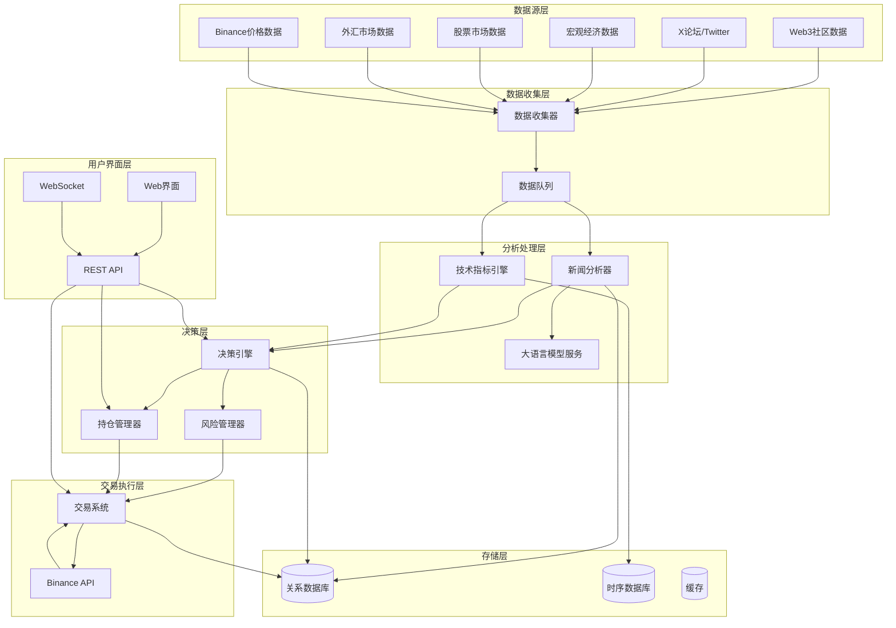

# 设计文档

## 概述

事件驱动的比特币交易系统是一个多层架构的自动化交易平台。系统采用微服务架构，通过事件驱动的方式处理数据收集、分析、决策和交易执行。核心设计理念是将数据收集、情绪分析、技术分析、风险管理和交易执行解耦，确保系统的可扩展性和可维护性。

## 架构

### 系统架构图



### 技术栈选择

**后端服务**:
- **Python**: 主要开发语言，丰富的金融和机器学习库
- **FastAPI**: 高性能API框架，支持异步处理
- **Celery**: 分布式任务队列，处理异步数据分析
- **Redis**: 缓存和消息队列
- **PostgreSQL**: 主数据库，存储交易记录和配置
- **InfluxDB**: 时序数据库，存储价格和技术指标数据

**前端界面**:
- **React**: 现代化前端框架
- **TypeScript**: 类型安全的JavaScript
- **Chart.js/TradingView**: 金融图表库
- **WebSocket**: 实时数据推送

**外部服务**:
- **OpenAI GPT-4**: 新闻情绪分析
- **Binance API**: 交易执行和市场数据
- **各类新闻API**: 数据源接入

## 组件和接口

### 数据收集器 (Data Collector)

**职责**: 从多个数据源收集原始数据并进行初步处理

**核心接口**:
```python
class DataCollector:
    def collect_web3_news(self) -> List[NewsItem]
    def collect_twitter_data(self, keywords: List[str]) -> List[TweetData]
    def collect_macro_economic_data(self) -> List[EconomicIndicator]
    def collect_market_data(self, symbols: List[str]) -> List[MarketData]
    def schedule_collection_tasks(self) -> None
```

**数据源配置**:
- **Web3社区**: CoinDesk, CoinTelegraph, Decrypt等新闻网站
- **Twitter**: 通过Twitter API v2收集关键词相关推文
- **宏观经济**: Federal Reserve Economic Data (FRED), Yahoo Finance
- **股票市场**: Alpha Vantage, Yahoo Finance API
- **外汇市场**: Forex.com API, OANDA API

### 新闻分析器 (News Analyzer)

**职责**: 使用大语言模型分析新闻内容的情绪和影响

**核心接口**:
```python
class NewsAnalyzer:
    def analyze_sentiment(self, content: str) -> SentimentScore
    def assess_bitcoin_impact(self, content: str) -> ImpactAssessment
    def generate_market_summary(self, news_items: List[NewsItem]) -> MarketSummary
    
class SentimentScore:
    sentiment_value: float  # 0-100
    confidence: float
    key_factors: List[str]
    
class ImpactAssessment:
    short_term_impact: float  # -1 to 1 (负面到正面)
    long_term_impact: float
    impact_confidence: float
    reasoning: str
```

### 技术指标引擎 (Technical Indicator Engine)

**职责**: 计算各种技术分析指标并生成交易信号

**核心接口**:
```python
class TechnicalIndicatorEngine:
    def calculate_rsi(self, prices: List[float], period: int = 14) -> float
    def calculate_macd(self, prices: List[float]) -> MACDResult
    def calculate_bollinger_bands(self, prices: List[float]) -> BollingerBands
    def calculate_moving_averages(self, prices: List[float]) -> MovingAverages
    def generate_technical_signals(self, indicators: TechnicalIndicators) -> TechnicalSignal

class TechnicalSignal:
    signal_strength: float  # -1 to 1
    signal_type: SignalType  # BUY, SELL, HOLD
    confidence: float
    contributing_indicators: List[str]
```

### 决策引擎 (Decision Engine)

**职责**: 综合分析情绪数据和技术指标，生成交易决策

**核心接口**:
```python
class DecisionEngine:
    def analyze_market_conditions(self, 
                                sentiment: SentimentScore,
                                technical: TechnicalSignal,
                                portfolio: Portfolio) -> MarketAnalysis
    
    def generate_trading_decision(self, analysis: MarketAnalysis) -> TradingDecision
    def calculate_position_size(self, decision: TradingDecision, 
                              risk_params: RiskParameters) -> float

class TradingDecision:
    action: ActionType  # BUY, SELL, HOLD
    confidence: float
    suggested_amount: float
    price_range: PriceRange
    reasoning: str
    risk_level: RiskLevel
```

### 风险管理器 (Risk Manager)

**职责**: 评估和控制交易风险，确保资金安全

**核心接口**:
```python
class RiskManager:
    def assess_trade_risk(self, decision: TradingDecision, 
                         portfolio: Portfolio) -> RiskAssessment
    def validate_trade(self, decision: TradingDecision) -> bool
    def calculate_stop_loss(self, entry_price: float, 
                           risk_tolerance: float) -> float
    def monitor_portfolio_risk(self, portfolio: Portfolio) -> RiskStatus

class RiskAssessment:
    risk_score: float  # 0-100
    max_loss_potential: float
    risk_factors: List[str]
    recommended_position_size: float
```

### 交易系统 (Trading System)

**职责**: 执行实际的交易操作，与Binance API交互

**核心接口**:
```python
class TradingSystem:
    def execute_buy_order(self, amount: float, price_type: PriceType) -> OrderResult
    def execute_sell_order(self, amount: float, price_type: PriceType) -> OrderResult
    def get_account_balance(self) -> AccountBalance
    def get_open_orders(self) -> List[Order]
    def cancel_order(self, order_id: str) -> bool

class OrderResult:
    order_id: str
    status: OrderStatus
    executed_amount: float
    executed_price: float
    timestamp: datetime
```

## 数据模型

### 核心数据结构

```python
@dataclass
class NewsItem:
    id: str
    title: str
    content: str
    source: str
    published_at: datetime
    url: str
    sentiment_score: Optional[float] = None
    impact_assessment: Optional[ImpactAssessment] = None

@dataclass
class MarketData:
    symbol: str
    price: float
    volume: float
    timestamp: datetime
    source: str

@dataclass
class Portfolio:
    btc_balance: float
    usdt_balance: float
    total_value_usdt: float
    unrealized_pnl: float
    positions: List[Position]

@dataclass
class Position:
    symbol: str
    amount: float
    entry_price: float
    current_price: float
    pnl: float
    entry_time: datetime

@dataclass
class TradingRecord:
    id: str
    action: ActionType
    amount: float
    price: float
    timestamp: datetime
    decision_reasoning: str
    sentiment_score: float
    technical_signals: Dict[str, float]
```

### 数据库设计

**PostgreSQL表结构**:
```sql
-- 交易记录表
CREATE TABLE trading_records (
    id UUID PRIMARY KEY,
    action VARCHAR(10) NOT NULL,
    amount DECIMAL(18,8) NOT NULL,
    price DECIMAL(18,2) NOT NULL,
    timestamp TIMESTAMP NOT NULL,
    decision_reasoning TEXT,
    sentiment_score DECIMAL(5,2),
    technical_signals JSONB
);

-- 新闻数据表
CREATE TABLE news_items (
    id UUID PRIMARY KEY,
    title TEXT NOT NULL,
    content TEXT NOT NULL,
    source VARCHAR(100) NOT NULL,
    published_at TIMESTAMP NOT NULL,
    url TEXT,
    sentiment_score DECIMAL(5,2),
    impact_assessment JSONB
);

-- 持仓记录表
CREATE TABLE positions (
    id UUID PRIMARY KEY,
    symbol VARCHAR(20) NOT NULL,
    amount DECIMAL(18,8) NOT NULL,
    entry_price DECIMAL(18,2) NOT NULL,
    entry_time TIMESTAMP NOT NULL,
    exit_price DECIMAL(18,2),
    exit_time TIMESTAMP,
    pnl DECIMAL(18,2)
);
```

**InfluxDB时序数据**:
```
measurement: market_data
tags: symbol, source
fields: price, volume, rsi, macd, bollinger_upper, bollinger_lower
time: timestamp

measurement: sentiment_data
tags: source, category
fields: sentiment_score, impact_short, impact_long
time: timestamp
```

## 错误处理

### 异常处理策略

**数据收集异常**:
- API限流: 实现指数退避重试机制
- 网络超时: 设置合理的超时时间和重试次数
- 数据格式错误: 记录错误并跳过异常数据

**分析处理异常**:
- LLM服务不可用: 使用备用分析方法或缓存结果
- 计算错误: 验证输入数据有效性，提供默认值

**交易执行异常**:
- API连接失败: 立即停止自动交易，发送警报
- 余额不足: 调整交易数量或暂停交易
- 订单失败: 记录失败原因，评估是否重试

### 监控和告警

```python
class AlertManager:
    def send_critical_alert(self, message: str, details: Dict) -> None
    def send_warning_alert(self, message: str) -> None
    def log_system_event(self, event_type: str, data: Dict) -> None

# 关键告警场景
- 连续交易失败超过3次
- 单日亏损超过设定阈值
- API连接中断超过5分钟
- 数据收集中断超过30分钟
- 系统内存或CPU使用率超过80%
```

## 正确性属性

*属性是一个特征或行为，应该在系统的所有有效执行中保持为真——本质上是关于系统应该做什么的正式声明。属性作为人类可读规范和机器可验证正确性保证之间的桥梁。*

### 属性反思

在分析所有可测试的验收标准后，我识别出以下需要合并或优化的冗余属性：

- 技术指标计算属性（3.1-3.4）可以合并为一个综合的技术指标计算正确性属性
- 交易执行属性（5.2-5.3）可以合并为一个通用的交易执行属性
- 数据收集属性（1.2-1.4）可以合并为一个通用的数据收集响应属性
- UI显示属性（8.2-8.3）可以合并为一个数据展示一致性属性

### 核心正确性属性

**属性 1: 数据收集响应性**
*对于任何*数据源事件（新闻发布、市场数据更新、经济指标发布），数据收集器应该在预设时间内检测并收集相关数据
**验证需求: 需求 1.2, 1.3, 1.4**

**属性 2: 情绪分析输出有效性**
*对于任何*有效的新闻内容输入，新闻分析器应该生成0-100范围内的情绪评分，并包含短期和长期影响评估
**验证需求: 需求 2.2, 2.3, 2.4**

**属性 3: 技术指标计算正确性**
*对于任何*有效的价格数据序列，技术指标引擎应该计算出数学上正确的RSI、MACD、移动平均线和布林带指标
**验证需求: 需求 3.1, 3.2, 3.3, 3.4**

**属性 4: 决策引擎综合分析**
*对于任何*有效的情绪分析结果和技术指标组合，决策引擎应该生成包含明确行动建议、置信度和风险评估的交易决策
**验证需求: 需求 4.1, 4.3**

**属性 5: 风险控制优先级**
*对于任何*交易决策，当风险评估超过预设阈值时，风险管理器应该拒绝或修改交易指令，优先保护资金安全
**验证需求: 需求 4.5, 6.3, 6.4**

**属性 6: 交易执行一致性**
*对于任何*有效的交易指令（买入或卖出），交易系统应该通过Binance API执行相应操作并更新本地持仓记录
**验证需求: 需求 5.2, 5.3, 5.4**

**属性 7: 持仓状态同步**
*对于任何*交易执行或价格变化事件，持仓管理器应该实时更新持仓信息并正确计算盈亏状况
**验证需求: 需求 6.1, 6.2**

**属性 8: 错误处理和恢复**
*对于任何*系统组件的失败（API调用失败、数据收集中断等），系统应该记录错误、尝试恢复并在必要时触发告警
**验证需求: 需求 1.5, 5.5**

**属性 9: 数据持久化完整性**
*对于任何*收集的数据或执行的交易，数据存储系统应该完整记录所有信息，支持后续查询和分析
**验证需求: 需求 9.1, 9.2**

**属性 10: 动态策略调整**
*对于任何*新的市场事件（新闻、技术指标变化、异常波动），系统应该重新评估当前策略并考虑必要的调整
**验证需求: 需求 7.1, 7.2, 7.3**

**属性 11: 配置安全性**
*对于任何*敏感配置信息（API密钥、交易参数），安全管理器应该使用加密存储和传输，并验证访问权限
**验证需求: 需求 10.3, 10.4**

## 测试策略

### 双重测试方法

**单元测试**:
- 验证具体示例、边界情况和错误条件
- 测试技术指标计算的数学准确性
- 验证风险管理规则的逻辑正确性
- 测试API接口的输入输出格式

**属性测试**:
- 验证跨所有输入的通用属性
- 使用随机生成的市场数据测试系统行为
- 验证系统在各种市场条件下的稳定性
- 测试错误处理机制的鲁棒性

### 属性测试配置

**测试框架**: Hypothesis (Python属性测试库)
**测试配置**: 每个属性测试最少运行100次迭代
**测试标签格式**: **Feature: bitcoin-trading-system, Property {number}: {property_text}**

### 测试工具和框架

**单元测试工具**:
- pytest: Python测试框架
- unittest.mock: 模拟外部API调用
- pytest-asyncio: 异步代码测试

**属性测试工具**:
- Hypothesis: 属性测试和数据生成
- pytest-hypothesis: Hypothesis与pytest集成

**集成测试**:
- 端到端数据流测试
- 外部API集成测试（使用沙盒环境）
- 数据库操作测试
- 消息队列处理测试

### 回测系统

**历史数据回测**:
```python
class BacktestEngine:
    def run_backtest(self, start_date: datetime, end_date: datetime, 
                    strategy_config: Dict) -> BacktestResult
    def simulate_trading(self, historical_data: List[MarketData]) -> List[Trade]
    def calculate_performance_metrics(self, trades: List[Trade]) -> PerformanceMetrics

class PerformanceMetrics:
    total_return: float
    sharpe_ratio: float
    max_drawdown: float
    win_rate: float
    profit_factor: float
```