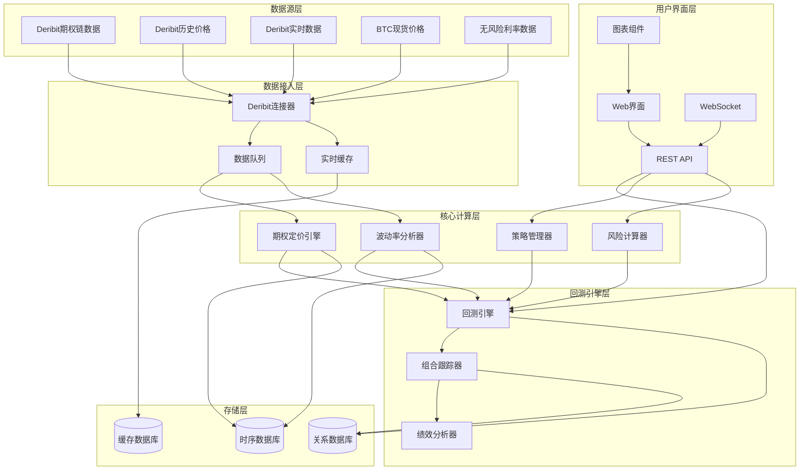

# BTC期权交易回测系统设计文档

## 概述

BTC期权交易回测系统是一个专门用于比特币期权策略回测和分析的平台。系统采用模块化架构，集成Deribit API获取期权数据，使用Black-Scholes等数学模型进行期权定价，支持多种期权交易策略的历史回测。核心设计理念是提供准确的期权定价、全面的风险管理和直观的策略分析工具。

## 架构

### 系统架构图



### 技术栈选择

**后端服务**:
- **Python**: 主要开发语言，丰富的金融数学库支持
- **FastAPI**: 高性能API框架，支持异步处理
- **NumPy/SciPy**: 数值计算和科学计算库
- **QuantLib**: 专业的量化金融库，用于期权定价
- **Pandas**: 数据处理和分析
- **Redis**: 高性能缓存和实时数据存储
- **PostgreSQL**: 主数据库，存储策略和回测结果
- **InfluxDB**: 时序数据库，存储价格和波动率数据

**前端界面**:
- **React**: 现代化前端框架
- **TypeScript**: 类型安全的JavaScript
- **D3.js/Plotly**: 专业的金融图表库
- **Material-UI**: 现代化UI组件库
- **WebSocket**: 实时数据推送

**外部服务**:
- **Deribit API**: 期权数据和交易接口
- **Yahoo Finance/Alpha Vantage**: 补充市场数据
- **FRED API**: 无风险利率数据

## 组件和接口

### Deribit连接器 (Deribit Connector)

**职责**: 与Deribit API交互，获取期权链数据和市场信息

**核心接口**:
```python
class DeribitConnector:
    def authenticate(self, api_key: str, api_secret: str) -> bool
    def get_options_chain(self, currency: str = "BTC") -> List[OptionContract]
    def get_historical_data(self, instrument: str, start_date: datetime, 
                           end_date: datetime) -> List[HistoricalData]
    def get_real_time_data(self, instruments: List[str]) -> Dict[str, MarketData]
    def get_volatility_surface(self, currency: str = "BTC") -> VolatilitySurface
    
class OptionContract:
    instrument_name: str
    option_type: str  # "call" or "put"
    strike_price: float
    expiration_date: datetime
    underlying_price: float
    bid_price: float
    ask_price: float
    last_price: float
    implied_volatility: float
    open_interest: int
    volume: int
```

### 期权定价引擎 (Options Engine)

**职责**: 使用各种数学模型计算期权理论价格和希腊字母

**核心接口**:
```python
class OptionsEngine:
    def black_scholes_price(self, S: float, K: float, T: float, r: float, 
                           sigma: float, option_type: str) -> float
    def calculate_greeks(self, S: float, K: float, T: float, r: float, 
                        sigma: float, option_type: str) -> Greeks
    def binomial_tree_price(self, S: float, K: float, T: float, r: float, 
                           sigma: float, steps: int, option_type: str) -> float
    def monte_carlo_price(self, S: float, K: float, T: float, r: float, 
                         sigma: float, simulations: int, option_type: str) -> float
    def implied_volatility(self, market_price: float, S: float, K: float, 
                          T: float, r: float, option_type: str) -> float

class Greeks:
    delta: float
    gamma: float
    theta: float
    vega: float
    rho: float
    
    def __post_init__(self):
        # 验证希腊字母的合理范围
        assert -1 <= self.delta <= 1, "Delta must be between -1 and 1"
        assert self.gamma >= 0, "Gamma must be non-negative"
```

### 策略管理器 (Strategy Manager)

**职责**: 创建、管理和验证各种期权交易策略

**核心接口**:
```python
class StrategyManager:
    def create_single_leg_strategy(self, option_type: str, action: str, 
                                  strike: float, expiry: datetime, 
                                  quantity: int) -> Strategy
    def create_straddle(self, strike: float, expiry: datetime, 
                       quantity: int, long: bool = True) -> Strategy
    def create_strangle(self, call_strike: float, put_strike: float, 
                       expiry: datetime, quantity: int, long: bool = True) -> Strategy
    def create_iron_condor(self, strikes: List[float], expiry: datetime, 
                          quantity: int) -> Strategy
    def create_butterfly(self, center_strike: float, wing_width: float, 
                        expiry: datetime, quantity: int) -> Strategy
    def validate_strategy(self, strategy: Strategy) -> ValidationResult

class Strategy:
    name: str
    legs: List[StrategyLeg]
    max_profit: Optional[float]
    max_loss: Optional[float]
    breakeven_points: List[float]
    
class StrategyLeg:
    option_contract: OptionContract
    action: str  # "buy" or "sell"
    quantity: int
```

### 波动率分析器 (Volatility Analyzer)

**职责**: 分析历史波动率、隐含波动率和构建波动率曲面

**核心接口**:
```python
class VolatilityAnalyzer:
    def calculate_historical_volatility(self, prices: List[float], 
                                      window: int = 30) -> float
    def build_volatility_surface(self, options_data: List[OptionContract]) -> VolatilitySurface
    def calculate_term_structure(self, options_data: List[OptionContract]) -> TermStructure
    def detect_volatility_anomalies(self, historical_vol: float, 
                                   implied_vol: float, threshold: float = 0.1) -> bool
    def garch_forecast(self, returns: List[float], horizon: int = 30) -> List[float]

class VolatilitySurface:
    strikes: List[float]
    expiries: List[datetime]
    volatilities: np.ndarray  # 2D array of implied volatilities
    
    def interpolate_volatility(self, strike: float, expiry: datetime) -> float
    def plot_surface(self) -> None
```

### 回测引擎 (Backtest Engine)

**职责**: 执行期权策略的历史回测和绩效分析

**核心接口**:
```python
class BacktestEngine:
    def run_backtest(self, strategy: Strategy, start_date: datetime, 
                    end_date: datetime, initial_capital: float) -> BacktestResult
    def simulate_option_expiry(self, option: OptionContract, 
                              underlying_price: float) -> float
    def calculate_time_decay(self, option: OptionContract, 
                           days_passed: int) -> float
    def handle_early_exercise(self, option: OptionContract, 
                             underlying_price: float) -> bool

class BacktestResult:
    strategy_name: str
    start_date: datetime
    end_date: datetime
    initial_capital: float
    final_capital: float
    total_return: float
    sharpe_ratio: float
    max_drawdown: float
    win_rate: float
    trades: List[Trade]
    daily_pnl: List[DailyPnL]
    
class Trade:
    timestamp: datetime
    action: str  # "open", "close", "expire"
    option_contract: OptionContract
    quantity: int
    price: float
    pnl: float
```

### 风险计算器 (Risk Calculator)

**职责**: 计算组合风险指标和执行风险管理

**核心接口**:
```python
class RiskCalculator:
    def calculate_portfolio_greeks(self, positions: List[Position]) -> PortfolioGreeks
    def calculate_var(self, positions: List[Position], confidence: float = 0.95, 
                     horizon: int = 1) -> float
    def stress_test(self, positions: List[Position], 
                   scenarios: List[MarketScenario]) -> List[StressTestResult]
    def calculate_margin_requirement(self, positions: List[Position]) -> float
    def check_risk_limits(self, positions: List[Position], 
                         limits: RiskLimits) -> List[RiskAlert]

class PortfolioGreeks:
    total_delta: float
    total_gamma: float
    total_theta: float
    total_vega: float
    total_rho: float
    
class MarketScenario:
    underlying_change: float  # percentage change in underlying
    volatility_change: float  # absolute change in volatility
    time_decay_days: int
```

## 数据模型

### 核心数据结构

```python
@dataclass
class OptionContract:
    instrument_name: str
    underlying: str
    option_type: str  # "call" or "put"
    strike_price: float
    expiration_date: datetime
    current_price: float
    bid_price: float
    ask_price: float
    last_price: float
    implied_volatility: float
    delta: float
    gamma: float
    theta: float
    vega: float
    rho: float
    open_interest: int
    volume: int
    timestamp: datetime

@dataclass
class Position:
    option_contract: OptionContract
    quantity: int  # positive for long, negative for short
    entry_price: float
    entry_date: datetime
    current_value: float
    unrealized_pnl: float

@dataclass
class Portfolio:
    positions: List[Position]
    cash_balance: float
    total_value: float
    total_delta: float
    total_gamma: float
    total_theta: float
    total_vega: float
    margin_used: float
    margin_available: float
    last_updated: datetime

@dataclass
class MarketData:
    symbol: str
    price: float
    bid: float
    ask: float
    volume: int
    timestamp: datetime
    
@dataclass
class HistoricalData:
    timestamp: datetime
    open_price: float
    high_price: float
    low_price: float
    close_price: float
    volume: int
    implied_volatility: Optional[float] = None
```

### 数据库设计

**PostgreSQL表结构**:
```sql
-- 期权合约表
CREATE TABLE option_contracts (
    id UUID PRIMARY KEY,
    instrument_name VARCHAR(50) UNIQUE NOT NULL,
    underlying VARCHAR(10) NOT NULL,
    option_type VARCHAR(4) NOT NULL CHECK (option_type IN ('call', 'put')),
    strike_price DECIMAL(18,2) NOT NULL,
    expiration_date TIMESTAMP NOT NULL,
    created_at TIMESTAMP DEFAULT NOW()
);

-- 策略表
CREATE TABLE strategies (
    id UUID PRIMARY KEY,
    name VARCHAR(100) NOT NULL,
    description TEXT,
    strategy_type VARCHAR(50) NOT NULL,
    max_profit DECIMAL(18,2),
    max_loss DECIMAL(18,2),
    created_at TIMESTAMP DEFAULT NOW(),
    updated_at TIMESTAMP DEFAULT NOW()
);

-- 策略腿表
CREATE TABLE strategy_legs (
    id UUID PRIMARY KEY,
    strategy_id UUID REFERENCES strategies(id),
    option_contract_id UUID REFERENCES option_contracts(id),
    action VARCHAR(4) NOT NULL CHECK (action IN ('buy', 'sell')),
    quantity INTEGER NOT NULL,
    leg_order INTEGER NOT NULL
);

-- 回测结果表
CREATE TABLE backtest_results (
    id UUID PRIMARY KEY,
    strategy_id UUID REFERENCES strategies(id),
    start_date TIMESTAMP NOT NULL,
    end_date TIMESTAMP NOT NULL,
    initial_capital DECIMAL(18,2) NOT NULL,
    final_capital DECIMAL(18,2) NOT NULL,
    total_return DECIMAL(8,4) NOT NULL,
    sharpe_ratio DECIMAL(8,4),
    max_drawdown DECIMAL(8,4),
    win_rate DECIMAL(5,4),
    total_trades INTEGER,
    created_at TIMESTAMP DEFAULT NOW()
);

-- 交易记录表
CREATE TABLE trades (
    id UUID PRIMARY KEY,
    backtest_id UUID REFERENCES backtest_results(id),
    timestamp TIMESTAMP NOT NULL,
    action VARCHAR(10) NOT NULL,
    option_contract_id UUID REFERENCES option_contracts(id),
    quantity INTEGER NOT NULL,
    price DECIMAL(18,8) NOT NULL,
    pnl DECIMAL(18,2),
    portfolio_value DECIMAL(18,2)
);
```

**InfluxDB时序数据**:
```
measurement: option_prices
tags: instrument_name, option_type
fields: bid_price, ask_price, last_price, implied_volatility, delta, gamma, theta, vega, rho, volume, open_interest
time: timestamp

measurement: underlying_prices
tags: symbol
fields: price, volume, volatility_30d, volatility_60d, volatility_90d
time: timestamp

measurement: portfolio_metrics
tags: portfolio_id, strategy_name
fields: total_value, total_delta, total_gamma, total_theta, total_vega, margin_used, unrealized_pnl
time: timestamp
```

## 错误处理

### 异常处理策略

**API连接异常**:
- 网络超时: 实现指数退避重试，最大重试3次
- 认证失败: 立即停止请求，记录错误并通知用户
- 限流错误: 根据API限制调整请求频率

**数学计算异常**:
- 数值溢出: 使用高精度计算库，设置合理的参数范围
- 收敛失败: 提供多种数值方法作为备选
- 无效参数: 严格的输入验证和错误提示

**数据异常**:
- 缺失数据: 使用插值方法填补或跳过异常数据点
- 异常值: 实现异常值检测和过滤机制
- 数据不一致: 多源数据交叉验证

```python
class OptionsCalculationError(Exception):
    """期权计算相关错误"""
    pass

class DataValidationError(Exception):
    """数据验证错误"""
    pass

class APIConnectionError(Exception):
    """API连接错误"""
    pass

# 错误处理装饰器
def handle_calculation_errors(func):
    def wrapper(*args, **kwargs):
        try:
            return func(*args, **kwargs)
        except (ValueError, ZeroDivisionError) as e:
            raise OptionsCalculationError(f"计算错误: {str(e)}")
        except Exception as e:
            logger.error(f"未预期的错误: {str(e)}")
            raise
    return wrapper
```

## 正确性属性

*属性是一个特征或行为，应该在系统的所有有效执行中保持为真——本质上是关于系统应该做什么的正式声明。属性作为人类可读规范和机器可验证正确性保证之间的桥梁。*

### 属性反思

在分析所有可测试的验收标准后，我识别出以下需要合并或优化的冗余属性：

- Deribit连接器的数据获取属性（1.2-1.4）可以合并为一个通用的数据完整性属性
- 期权定价引擎的计算属性（2.1-2.4）可以合并为一个期权定价正确性属性
- 策略管理器的创建属性（3.1-3.3）可以合并为一个策略构建属性
- 波动率分析器的计算属性（4.1-4.3）可以合并为一个波动率计算属性
- 回测引擎的执行属性（5.1-5.3）可以合并为一个回测执行属性
- 风险计算器的计算属性（6.1-6.3）可以合并为一个风险计算属性
- 组合跟踪器的跟踪属性（7.1-7.3）可以合并为一个组合跟踪属性
- 用户界面的显示属性（8.2-8.4）可以合并为一个UI功能属性
- 数据存储的存储属性（9.1-9.3）可以合并为一个数据存储属性
- 配置管理器的管理属性（10.1-10.3）可以合并为一个配置管理属性

### 核心正确性属性

**属性 1: Deribit数据完整性**
*对于任何*有效的Deribit API请求（期权链、历史数据、实时数据），连接器应该返回包含所有必需字段的完整数据，并在API失败时正确处理错误和重试
**验证需求: 需求 1.2, 1.3, 1.4, 1.5**

**属性 2: 期权定价计算正确性**
*对于任何*有效的期权参数组合（标的价格、执行价格、到期时间、无风险利率、波动率），期权引擎应该使用正确的数学模型计算出理论价格和所有希腊字母，并在参数无效时返回适当的错误信息
**验证需求: 需求 2.1, 2.2, 2.3, 2.4, 2.5**

**属性 3: 策略构建和验证**
*对于任何*策略类型（单腿、多腿、复合策略），策略管理器应该正确构建策略结构，设置所有必需参数，并验证策略配置的有效性
**验证需求: 需求 3.1, 3.2, 3.3, 3.4, 3.5**

**属性 4: 波动率分析准确性**
*对于任何*价格数据序列和期权数据，波动率分析器应该准确计算历史波动率、构建波动率曲面、检测异常值并提供GARCH预测
**验证需求: 需求 4.1, 4.2, 4.3, 4.4, 4.5**

**属性 5: 回测执行一致性**
*对于任何*有效的策略和时间范围，回测引擎应该正确加载历史数据、模拟交易执行、计算考虑时间价值衰减的盈亏、处理期权到期并生成完整的绩效报告
**验证需求: 需求 5.1, 5.2, 5.3, 5.4, 5.5**

**属性 6: 风险计算准确性**
*对于任何*期权组合，风险计算器应该正确聚合组合希腊字母、计算各种市场情景下的潜在损失、计算保证金需求并在风险超限时触发适当的警报
**验证需求: 需求 6.1, 6.2, 6.3, 6.4, 6.5**

**属性 7: 组合跟踪实时性**
*对于任何*市场数据更新或组合变化，组合跟踪器应该实时更新每个期权合约的价值和希腊字母、记录完整的交易历史并生成准确的绩效分析报告
**验证需求: 需求 7.1, 7.2, 7.3, 7.4, 7.5**

**属性 8: 用户界面功能完整性**
*对于任何*用户操作（参数设置、结果查看、策略分析、策略比较），用户界面应该提供完整的功能支持、正确显示所有必需信息并支持多策略并行分析
**验证需求: 需求 8.2, 8.3, 8.4, 8.5**

**属性 9: 数据存储可靠性**
*对于任何*数据操作（存储、查询、缓存、备份、清理），数据存储系统应该保证数据完整性、提供高效的查询性能、正确缓存计算结果并自动管理数据生命周期
**验证需求: 需求 9.1, 9.2, 9.3, 9.4, 9.5**

**属性 10: 配置管理安全性**
*对于任何*配置操作（API凭证存储、参数验证、配置更新、系统监控、错误处理），配置管理器应该确保安全存储、参数有效性验证、支持热更新并提供完整的监控和日志记录
**验证需求: 需求 10.1, 10.2, 10.3, 10.4, 10.5**

## 测试策略

### 双重测试方法

**单元测试**:
- 验证期权定价公式的数学准确性
- 测试希腊字母计算的边界条件
- 验证策略构建逻辑的正确性
- 测试API接口的输入输出格式
- 验证数据验证规则的有效性

**属性测试**:
- 使用随机生成的期权参数验证定价模型
- 测试各种市场条件下的策略表现
- 验证风险计算在极端情况下的稳定性
- 测试数据存储和检索的一致性
- 验证系统在各种配置下的正确行为

### 属性测试配置

**测试框架**: Hypothesis (Python属性测试库)
**测试配置**: 每个属性测试最少运行100次迭代
**测试标签格式**: **Feature: btc-options-trading-system, Property {number}: {property_text}**

### 专业测试场景

**期权定价测试**:
```python
# 测试Black-Scholes公式的数学性质
@given(
    S=st.floats(min_value=1, max_value=10000),  # 标的价格
    K=st.floats(min_value=1, max_value=10000),  # 执行价格
    T=st.floats(min_value=0.01, max_value=5),   # 到期时间
    r=st.floats(min_value=0, max_value=0.2),    # 无风险利率
    sigma=st.floats(min_value=0.01, max_value=2) # 波动率
)
def test_call_put_parity(S, K, T, r, sigma):
    """测试看涨看跌期权平价关系"""
    call_price = black_scholes_call(S, K, T, r, sigma)
    put_price = black_scholes_put(S, K, T, r, sigma)
    
    # Call - Put = S - K * exp(-r*T)
    parity_diff = call_price - put_price
    theoretical_diff = S - K * np.exp(-r * T)
    
    assert abs(parity_diff - theoretical_diff) < 1e-10
```

**策略回测测试**:
```python
@given(
    initial_capital=st.floats(min_value=1000, max_value=100000),
    strategy=st.sampled_from(['straddle', 'strangle', 'iron_condor']),
    market_scenario=st.sampled_from(['bullish', 'bearish', 'sideways'])
)
def test_backtest_consistency(initial_capital, strategy, market_scenario):
    """测试回测结果的一致性"""
    result = run_backtest(strategy, initial_capital, market_scenario)
    
    # 验证基本约束
    assert result.final_capital >= 0  # 资金不能为负
    assert len(result.trades) >= 0    # 交易记录完整
    assert result.total_return == (result.final_capital - initial_capital) / initial_capital
```

### 回测系统验证

**历史数据回测**:
```python
class BacktestValidator:
    def validate_option_expiry_handling(self, strategy: Strategy, 
                                      historical_data: List[MarketData]) -> bool
    def validate_time_decay_calculation(self, option: OptionContract, 
                                      time_series: List[datetime]) -> bool
    def validate_volatility_impact(self, strategy: Strategy, 
                                 volatility_scenarios: List[float]) -> bool
    def validate_early_exercise_logic(self, american_option: OptionContract,
                                    underlying_path: List[float]) -> bool

# 性能指标验证
class PerformanceMetrics:
    def calculate_sharpe_ratio(self, returns: List[float], 
                             risk_free_rate: float) -> float
    def calculate_maximum_drawdown(self, equity_curve: List[float]) -> float
    def calculate_calmar_ratio(self, total_return: float, 
                             max_drawdown: float) -> float
    def calculate_sortino_ratio(self, returns: List[float], 
                              target_return: float) -> float
```