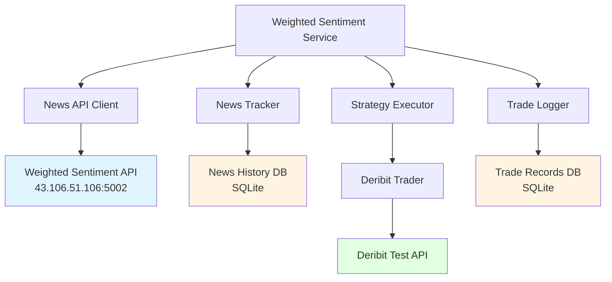
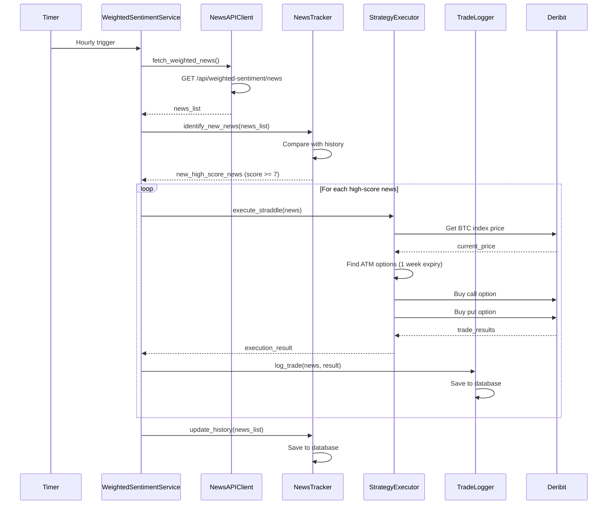
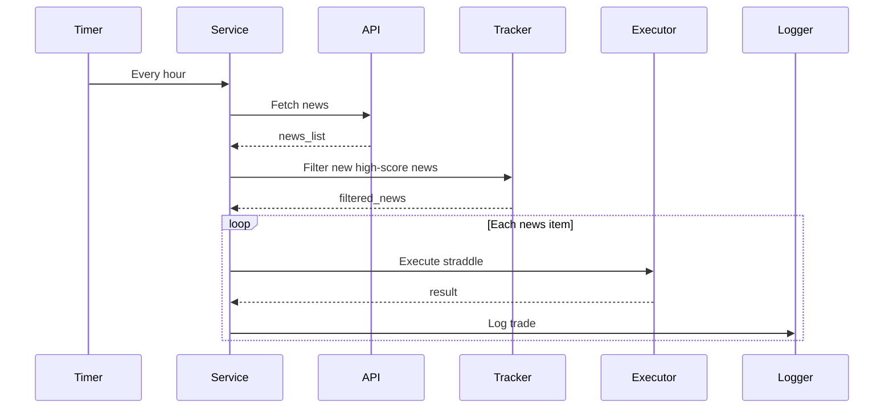

# Design Document: Weighted Sentiment Straddle Trading

## Overview

基于现有 Sentiment_Trading_Quickstart 系统，新增一个使用加权情绪新闻 API 的交易功能。该功能每小时读取新 API，筛选高重要性评分（≥7分）的新闻，无论情绪方向如何，都买入 ATM Straddle 期权。核心目标是验证新闻评分系统的准确性，假设高分新闻会引发更大市场波动，使 Straddle 策略更有可能盈利。

## Architecture



## Sequence Diagrams

### Main Workflow: Hourly News Check and Trading



## Components and Interfaces

### Component 1: NewsAPIClient

**Purpose**: 与加权情绪新闻 API 交互，获取新闻数据

**Interface**:
```python
class NewsAPIClient:
    async def fetch_weighted_news(self) -> List[WeightedNews]:
        """获取加权情绪新闻列表"""
        pass
```

**Responsibilities**:
- 发送 HTTP 请求到新闻 API
- 解析 API 响应
- 处理网络错误和超时
- 返回结构化的新闻对象列表

### Component 2: NewsTracker

**Purpose**: 跟踪已处理的新闻，识别新增的高分新闻

**Interface**:
```python
class NewsTracker:
    async def identify_new_news(self, news_list: List[WeightedNews]) -> List[WeightedNews]:
        """识别新增的高分新闻（score >= 7）"""
        pass
    
    async def update_history(self, news_list: List[WeightedNews]) -> None:
        """更新新闻历史记录"""
        pass
    
    async def is_news_processed(self, news_id: str) -> bool:
        """检查新闻是否已处理"""
        pass
```

**Responsibilities**:
- 维护新闻历史数据库
- 识别新增新闻（通过唯一标识符）
- 筛选高重要性评分的新闻（importance_score >= 7）
- 防止重复处理同一新闻

### Component 3: StraddleExecutor

**Purpose**: 执行 ATM Straddle 期权交易策略

**Interface**:
```python
class StraddleExecutor:
    def __init__(self, api_key: str, api_secret: str):
        """初始化执行器，使用独立的 Deribit Test 账户凭证"""
        pass
    
    async def execute_straddle(
        self, 
        news: WeightedNews,
        underlying: str = "BTC"
    ) -> StraddleTradeResult:
        """执行 ATM Straddle 交易"""
        pass
    
    async def find_atm_options(
        self, 
        spot_price: float,
        expiry_days: int = 7
    ) -> Tuple[str, str]:
        """查找 ATM 看涨和看跌期权"""
        pass
```

**Responsibilities**:
- 使用独立的 Deribit Test 账户凭证（与现有 sentiment_trading_service 分离）
- 获取当前 BTC 指数价格
- 查找接近 ATM 的期权合约（7天后到期）
- 同时买入看涨和看跌期权
- 返回交易执行结果

### Component 4: TradeLogger

**Purpose**: 记录交易与新闻的关联信息

**Interface**:
```python
class TradeLogger:
    async def log_trade(
        self, 
        news: WeightedNews,
        trade_result: StraddleTradeResult
    ) -> None:
        """记录交易信息"""
        pass
    
    async def get_trade_history(
        self,
        start_date: Optional[datetime] = None,
        end_date: Optional[datetime] = None
    ) -> List[TradeRecord]:
        """查询交易历史"""
        pass
```

**Responsibilities**:
- 保存交易与新闻的完整关联信息
- 记录新闻内容、评分、情绪方向
- 记录期权详情（执行价、到期日、价格）
- 提供历史查询接口

### Component 5: WeightedSentimentService

**Purpose**: 主服务协调器，管理整个工作流程

**Interface**:
```python
class WeightedSentimentService:
    def __init__(self):
        """初始化服务，从环境变量读取独立的 Deribit 凭证"""
        pass
    
    async def hourly_check(self) -> None:
        """每小时检查和交易"""
        pass
    
    async def run(self) -> None:
        """主运行循环"""
        pass
```

**Responsibilities**:
- 从环境变量读取独立的 Deribit Test 账户凭证（WEIGHTED_SENTIMENT_DERIBIT_API_KEY 和 WEIGHTED_SENTIMENT_DERIBIT_API_SECRET）
- 每小时触发新闻检查
- 协调各组件完成交易流程
- 处理异常和错误
- 记录服务运行日志

## Data Models

### Model 1: WeightedNews

```python
@dataclass
class WeightedNews:
    news_id: str              # 新闻唯一标识符
    content: str              # 新闻内容
    sentiment: str            # 情绪方向: "positive", "negative", "neutral"
    importance_score: int     # 重要性评分: 1-10
    timestamp: datetime       # 新闻时间戳
    source: Optional[str]     # 新闻来源
```

**Validation Rules**:
- news_id 必须非空且唯一
- importance_score 必须在 1-10 范围内
- sentiment 必须是 "positive", "negative", "neutral" 之一
- timestamp 必须是有效的日期时间

### Model 2: StraddleTradeResult

```python
@dataclass
class StraddleTradeResult:
    success: bool
    news_id: str
    trade_time: datetime
    spot_price: float
    call_option: OptionTrade
    put_option: OptionTrade
    total_cost: float
    error_message: Optional[str] = None
```

**Validation Rules**:
- success 为 True 时，call_option 和 put_option 必须非空
- success 为 False 时，error_message 必须提供
- total_cost 必须为正数

### Model 3: OptionTrade

```python
@dataclass
class OptionTrade:
    instrument_name: str      # 期权合约名称
    option_type: str          # "call" or "put"
    strike_price: float       # 执行价格
    expiry_date: datetime     # 到期日
    premium: float            # 期权价格
    quantity: float           # 交易数量
    order_id: Optional[str]   # Deribit 订单ID
```

**Validation Rules**:
- option_type 必须是 "call" 或 "put"
- strike_price, premium, quantity 必须为正数
- expiry_date 必须在未来

### Model 4: TradeRecord

```python
@dataclass
class TradeRecord:
    id: int
    news_id: str
    news_content: str
    sentiment: str
    importance_score: int
    trade_time: datetime
    spot_price: float
    call_instrument: str
    call_strike: float
    call_premium: float
    put_instrument: str
    put_strike: float
    put_premium: float
    total_cost: float
    success: bool
    error_message: Optional[str] = None
```

## Main Algorithm/Workflow



## Key Functions with Formal Specifications

### Function 1: identify_new_news()

```python
async def identify_new_news(
    self, 
    news_list: List[WeightedNews]
) -> List[WeightedNews]:
    """识别新增的高分新闻"""
    pass
```

**Preconditions:**
- news_list 是有效的 WeightedNews 对象列表
- 数据库连接已建立

**Postconditions:**
- 返回列表仅包含未处理过的新闻
- 返回列表中所有新闻的 importance_score >= 7
- 不修改输入参数
- 数据库状态不变（仅读取）

**Loop Invariants:**
- 遍历过程中，所有已检查的新闻要么被添加到结果列表，要么被跳过
- 结果列表中的新闻满足：未处理 AND 评分 >= 7

### Function 2: execute_straddle()

```python
async def execute_straddle(
    self, 
    news: WeightedNews,
    underlying: str = "BTC"
) -> StraddleTradeResult:
    """执行 ATM Straddle 交易"""
    pass
```

**Preconditions:**
- news 是有效的 WeightedNews 对象
- news.importance_score >= 7
- Deribit 连接已认证
- underlying 是支持的标的资产（"BTC" 或 "ETH"）

**Postconditions:**
- 如果成功：返回结果包含两个期权交易（call 和 put）
- 如果成功：两个期权的执行价格相同或非常接近
- 如果成功：两个期权的到期日相同（约7天后）
- 如果失败：返回结果包含错误信息
- 不抛出未捕获的异常

**Loop Invariants:** N/A（无循环）

### Function 3: find_atm_options()

```python
async def find_atm_options(
    self, 
    spot_price: float,
    expiry_days: int = 7
) -> Tuple[str, str]:
    """查找 ATM 看涨和看跌期权"""
    pass
```

**Preconditions:**
- spot_price > 0
- expiry_days > 0
- Deribit API 可访问

**Postconditions:**
- 返回元组包含两个合约名称：(call_instrument, put_instrument)
- 两个合约的执行价格相同或差异最小
- 两个合约的到期日在目标日期附近（误差 <= 1天）
- 如果找不到合适的合约，抛出 NoSuitableOptionsError

**Loop Invariants:**
- 遍历可用合约时，当前最佳匹配的执行价格与 spot_price 的差距最小

### Function 4: log_trade()

```python
async def log_trade(
    self, 
    news: WeightedNews,
    trade_result: StraddleTradeResult
) -> None:
    """记录交易信息"""
    pass
```

**Preconditions:**
- news 是有效的 WeightedNews 对象
- trade_result 是有效的 StraddleTradeResult 对象
- 数据库连接已建立

**Postconditions:**
- 交易记录已保存到数据库
- 记录包含新闻和交易的完整关联信息
- 数据库事务已提交
- 不抛出未捕获的异常（数据库错误被记录但不中断服务）

**Loop Invariants:** N/A（无循环）

## Algorithmic Pseudocode

### Main Processing Algorithm

```python
ALGORITHM hourly_check()
INPUT: None
OUTPUT: None (side effects: trades executed, logs written)

BEGIN
  // Step 1: Fetch news from API
  news_list ← fetch_weighted_news()
  
  IF news_list IS EMPTY THEN
    LOG "No news data available"
    RETURN
  END IF
  
  // Step 2: Identify new high-score news
  new_high_score_news ← identify_new_news(news_list)
  
  LOG "Found {count} new high-score news items" WHERE count = LENGTH(new_high_score_news)
  
  // Step 3: Execute straddle for each news item
  FOR EACH news IN new_high_score_news DO
    ASSERT news.importance_score >= 7
    
    TRY
      trade_result ← execute_straddle(news, "BTC")
      
      IF trade_result.success THEN
        LOG "Successfully executed straddle for news {news.news_id}"
      ELSE
        LOG "Failed to execute straddle: {trade_result.error_message}"
      END IF
      
      // Log trade regardless of success/failure
      log_trade(news, trade_result)
      
    CATCH Exception AS e
      LOG "Exception during trade execution: {e}"
      // Continue with next news item
    END TRY
  END FOR
  
  // Step 4: Update news history
  update_history(news_list)
  
  LOG "Hourly check completed"
END
```

**Preconditions:**
- Service is initialized and authenticated with Deribit
- Database connections are established
- News API is accessible

**Postconditions:**
- All new high-score news items have been processed
- Trades have been executed (or attempted) for each qualifying news
- All trades are logged in the database
- News history is updated

**Loop Invariants:**
- All previously processed news items have been logged
- Service remains in a consistent state even if individual trades fail

### News Identification Algorithm

```python
ALGORITHM identify_new_news(news_list)
INPUT: news_list of type List[WeightedNews]
OUTPUT: filtered_news of type List[WeightedNews]

BEGIN
  filtered_news ← EMPTY_LIST
  
  FOR EACH news IN news_list DO
    // Check if news is already processed
    is_processed ← is_news_processed(news.news_id)
    
    // Check if news meets score threshold
    is_high_score ← (news.importance_score >= 7)
    
    IF NOT is_processed AND is_high_score THEN
      filtered_news.APPEND(news)
    END IF
    
    // Loop invariant: filtered_news contains only unprocessed high-score news
    ASSERT ALL(n IN filtered_news: n.importance_score >= 7 AND NOT is_news_processed(n.news_id))
  END FOR
  
  RETURN filtered_news
END
```

**Preconditions:**
- news_list is a valid list of WeightedNews objects
- Database connection is available for checking processed news

**Postconditions:**
- filtered_news contains only news items that are:
  - Not previously processed
  - Have importance_score >= 7
- Original news_list is unchanged
- No side effects on database

**Loop Invariants:**
- All news items in filtered_news satisfy: importance_score >= 7 AND not processed
- All previously checked news items have been correctly classified

### Straddle Execution Algorithm

```python
ALGORITHM execute_straddle(news, underlying)
INPUT: news of type WeightedNews, underlying of type String
OUTPUT: result of type StraddleTradeResult

BEGIN
  ASSERT news.importance_score >= 7
  
  TRY
    // Step 1: Get current spot price
    spot_price ← get_index_price(underlying)
    
    IF spot_price <= 0 THEN
      RETURN StraddleTradeResult(
        success=FALSE,
        error_message="Invalid spot price"
      )
    END IF
    
    // Step 2: Find ATM options
    (call_instrument, put_instrument) ← find_atm_options(spot_price, expiry_days=7)
    
    // Step 3: Execute call option trade
    call_trade ← buy_option(call_instrument, quantity=0.1)
    
    IF call_trade.success = FALSE THEN
      RETURN StraddleTradeResult(
        success=FALSE,
        error_message="Failed to buy call option"
      )
    END IF
    
    // Step 4: Execute put option trade
    put_trade ← buy_option(put_instrument, quantity=0.1)
    
    IF put_trade.success = FALSE THEN
      // Attempt to close call position (best effort)
      TRY
        close_position(call_trade.order_id)
      CATCH
        LOG "Failed to close call position after put trade failure"
      END TRY
      
      RETURN StraddleTradeResult(
        success=FALSE,
        error_message="Failed to buy put option"
      )
    END IF
    
    // Step 5: Calculate total cost
    total_cost ← call_trade.premium + put_trade.premium
    
    // Step 6: Return successful result
    RETURN StraddleTradeResult(
      success=TRUE,
      news_id=news.news_id,
      trade_time=NOW(),
      spot_price=spot_price,
      call_option=call_trade,
      put_option=put_trade,
      total_cost=total_cost
    )
    
  CATCH Exception AS e
    LOG "Exception in execute_straddle: {e}"
    RETURN StraddleTradeResult(
      success=FALSE,
      error_message=STRING(e)
    )
  END TRY
END
```

**Preconditions:**
- news.importance_score >= 7
- Deribit connection is authenticated
- underlying is a valid asset ("BTC" or "ETH")

**Postconditions:**
- If success=TRUE: Both call and put options have been purchased
- If success=FALSE: No positions are left open (best effort cleanup)
- Result contains complete trade information or error message
- No uncaught exceptions

**Loop Invariants:** N/A (no loops)

## Example Usage

```python
# Example 1: Initialize and run service
async def main():
    service = WeightedSentimentService()
    await service.run()

# Example 2: Manual hourly check
async def manual_check():
    service = WeightedSentimentService()
    await service.hourly_check()

# Example 3: Query trade history
async def view_history():
    logger = TradeLogger()
    records = await logger.get_trade_history(
        start_date=datetime.now() - timedelta(days=7)
    )
    for record in records:
        print(f"News: {record.news_content[:50]}...")
        print(f"Score: {record.importance_score}")
        print(f"Cost: ${record.total_cost:.2f}")
        print("---")

# Example 4: Test news filtering
async def test_filtering():
    tracker = NewsTracker()
    news_list = [
        WeightedNews(
            news_id="news_001",
            content="Major BTC announcement",
            sentiment="positive",
            importance_score=9,
            timestamp=datetime.now()
        ),
        WeightedNews(
            news_id="news_002",
            content="Minor update",
            sentiment="neutral",
            importance_score=5,
            timestamp=datetime.now()
        )
    ]
    
    filtered = await tracker.identify_new_news(news_list)
    # filtered will only contain news_001 (score >= 7)
```

## Correctness Properties

*属性是一个特征或行为，应该在系统的所有有效执行中保持为真——本质上是关于系统应该做什么的正式陈述。属性作为人类可读规范和机器可验证正确性保证之间的桥梁。*

### Property 1: No Duplicate Trading

*对于任意* 新闻项，系统不应该为同一条新闻执行多次交易

**验证需求：需求 2.5**

### Property 2: Score Threshold Enforcement

*对于任意* 已执行的交易记录，其关联新闻的重要性评分必须 >= 7

**验证需求：需求 2.2**

### Property 3: Straddle Completeness

*对于任意* 成功的跨式交易，必须同时包含看涨和看跌期权，且两者的执行价格相同或非常接近

**验证需求：需求 3.4, 需求 4.5**

### Property 4: Trade-News Association

*对于任意* 交易记录，必须完整保存其触发新闻的所有信息（news_id、content、sentiment、importance_score）

**验证需求：需求 5.2**

### Property 5: Hourly Execution Frequency

*对于任意* 系统运行时间点，如果服务正在运行，则必须在 1 小时后（±5秒）触发新闻检查

**验证需求：需求 6.2, 需求 6.4**

### Property 6: Data Validation Completeness

*对于任意* WeightedNews 对象，必须满足：importance_score 在 1-10 范围内，sentiment 为有效值之一，news_id 非空

**验证需求：需求 8.1, 需求 8.2, 需求 8.3**

### Property 7: Option Trade Validation

*对于任意* OptionTrade 对象，必须满足：strike_price、premium、quantity 为正数，expiry_date 在未来

**验证需求：需求 8.4, 需求 8.5**

### Property 8: Trade Record Persistence Round-Trip

*对于任意* 交易记录，写入数据库后立即读取应该得到相同的数据（news_id、交易详情、时间戳等）

**验证需求：需求 5.1, 需求 5.6**

### Property 9: Query Result Ordering

*对于任意* 交易历史查询结果，记录必须按交易时间降序排列

**验证需求：需求 9.5**

### Property 10: Log Completeness

*对于任意* 关键操作（API 调用、交易执行、错误），必须在日志文件中记录包含时间戳、级别和详细消息的条目

**验证需求：需求 10.3, 需求 10.4**

### Property 11: Sensitive Information Protection

*对于任意* 日志条目，不应包含 API 密钥、密码或其他敏感凭证信息

**验证需求：需求 12.2**

### Property 12: Secure Communication

*对于任意* 外部 API 请求，必须使用 HTTPS 协议、验证 SSL 证书，并设置超时时间

**验证需求：需求 12.3, 需求 12.4, 需求 12.5**

### Property 13: ATM Option Selection Optimality

*对于任意* 给定的现货价格和可用期权列表，选中的期权执行价格与现货价格的差距应该是所有候选期权中最小的

**验证需求：需求 3.3**

### Property 14: News History Persistence

*对于任意* 新闻列表，处理完成后所有新闻的 news_id 和 timestamp 必须保存到 News_History_Database

**验证需求：需求 2.4**

### Property 15: Straddle Cost Calculation

*对于任意* 成功的跨式交易，total_cost 必须等于 call_premium + put_premium

**验证需求：需求 4.5**

## Error Handling

### Error Scenario 1: API Unavailable

**Condition**: Weighted sentiment API returns error or times out
**Response**: 
- Log error with timestamp
- Skip this hourly cycle
- Continue service operation
**Recovery**: 
- Retry on next hourly cycle
- No manual intervention required

### Error Scenario 2: No Suitable Options Found

**Condition**: Cannot find ATM options with 7-day expiry
**Response**:
- Log warning with current market conditions
- Skip trade for this news item
- Mark news as processed to avoid retry
**Recovery**:
- Continue with next news item
- System remains operational

### Error Scenario 3: Partial Straddle Execution

**Condition**: Call option purchased successfully, but put option fails
**Response**:
- Attempt to close call position (best effort)
- Log detailed error information
- Mark trade as failed in database
**Recovery**:
- Manual review of open positions
- Alert operator if position remains open

### Error Scenario 4: Database Connection Lost

**Condition**: Cannot connect to SQLite database
**Response**:
- Log critical error
- Pause trading operations
- Continue attempting to reconnect
**Recovery**:
- Automatic reconnection on next cycle
- If persistent, service restart required

### Error Scenario 5: Deribit Authentication Failure

**Condition**: API credentials invalid or expired
**Response**:
- Log critical error
- Stop trading operations
- Send alert notification
**Recovery**:
- Requires manual credential update
- Service restart after credential fix

## Testing Strategy

### Unit Testing Approach

**Key Test Cases**:
1. NewsAPIClient: Mock API responses, test parsing
2. NewsTracker: Test duplicate detection, score filtering
3. StraddleExecutor: Test option selection logic, price calculations
4. TradeLogger: Test database operations, query functions

**Coverage Goals**: 
- 90%+ code coverage
- All error paths tested
- Edge cases for score thresholds (6, 7, 8)

### Property-Based Testing Approach

**Property Test Library**: hypothesis (Python)

**Properties to Test**:
1. Score filtering: All filtered news have score >= 7
2. No duplicates: Same news_id never processed twice
3. Straddle symmetry: Call and put strikes are equal or within 1% of spot
4. Data integrity: All trades have complete news association

**Example Property Test**:
```python
from hypothesis import given, strategies as st

@given(st.lists(st.integers(min_value=1, max_value=10)))
def test_score_filtering_property(scores):
    """Property: Filtered news always have score >= 7"""
    news_list = [create_news(score=s) for s in scores]
    filtered = identify_new_news(news_list)
    assert all(n.importance_score >= 7 for n in filtered)
```

### Integration Testing Approach

**Test Scenarios**:
1. End-to-end: Mock API → Filter → Execute → Log
2. Deribit integration: Test with Deribit testnet
3. Database persistence: Verify data survives service restart
4. Error recovery: Simulate API failures, verify graceful handling

**Test Environment**: 
- Use Deribit testnet
- Separate test database
- Mock weighted sentiment API

## Performance Considerations

### Resource Constraints
- Server: 2 vCPU (limited CPU resources)
- Avoid CPU-intensive operations
- Use lightweight libraries

### Optimization Strategies
1. **Async I/O**: Use asyncio for all network operations
2. **Database Indexing**: Index news_id and timestamp columns
3. **Connection Pooling**: Reuse HTTP connections to APIs
4. **Minimal Dependencies**: Avoid heavy libraries (pandas, numpy)
5. **Efficient Queries**: Use SQL queries instead of loading all data

### Expected Load
- API calls: 1 request per hour to news API
- Trades: Estimated 0-5 trades per hour (depends on news volume)
- Database writes: ~10 writes per hour maximum
- Memory usage: < 100 MB

## Security Considerations

### API Key Management
- Store Deribit credentials in .env file using separate variables for weighted sentiment service:
  - `WEIGHTED_SENTIMENT_DERIBIT_API_KEY`: API key for weighted sentiment trading
  - `WEIGHTED_SENTIMENT_DERIBIT_API_SECRET`: API secret for weighted sentiment trading
- Keep these separate from existing sentiment trading credentials
- Never log API keys or secrets
- Use environment variables for sensitive data

### Data Privacy
- News content may contain sensitive information
- Store only necessary data
- Implement data retention policy (e.g., 90 days)

### Network Security
- Use HTTPS for all API communications
- Validate SSL certificates
- Implement request timeouts to prevent hanging

### Error Information
- Sanitize error messages before logging
- Avoid exposing internal system details
- Log security-relevant events (auth failures, etc.)

## Dependencies

### Core Dependencies
- **Python**: 3.7+
- **aiohttp**: Async HTTP client for API calls
- **asyncio**: Async runtime
- **sqlite3**: Built-in database (no external dependency)

### Existing Project Dependencies
- **DeribitTrader**: From existing sentiment_trading_service
- **StrategyExecutor**: From existing system (may need adaptation)
- **python-dotenv**: Environment variable management

### External Services
- **Weighted Sentiment API**: http://43.106.51.106:5002/api/weighted-sentiment/news
- **Deribit Test API**: https://test.deribit.com/api/v2/

### Deployment Dependencies
- **systemd**: For service management (Linux)
- **bash**: For startup scripts

## Deployment Strategy

### File Structure
```
BTCOptionsTrading/backend/
├── weighted_sentiment_service.py       # Main service
├── weighted_sentiment_api.py           # Status query API
├── start_weighted_sentiment.sh         # Startup script
├── stop_weighted_sentiment.sh          # Stop script
├── weighted_sentiment.service          # systemd service file
├── data/
│   ├── weighted_news_history.db       # News tracking database
│   └── weighted_trade_records.db      # Trade records database
└── logs/
    └── weighted_sentiment.log         # Service logs
```

### Deployment Steps
1. Copy service files to backend directory
2. Configure .env with separate Deribit testnet credentials:
   ```bash
   # Weighted Sentiment Trading (separate account)
   WEIGHTED_SENTIMENT_DERIBIT_API_KEY=your_api_key_here
   WEIGHTED_SENTIMENT_DERIBIT_API_SECRET=your_api_secret_here
   ```
3. Create systemd service file
4. Enable and start service
5. Verify logs for successful startup

### Monitoring
- Log file: `logs/weighted_sentiment.log`
- API endpoint: `http://localhost:5003/api/status`
- Database queries: Direct SQLite access for analysis

### Similarity to Existing Service
- Follow same patterns as `sentiment_trading_service.py`
- Use same deployment approach (systemd service)
- Reuse existing DeribitTrader and logging infrastructure
- Maintain consistency with existing codebase
