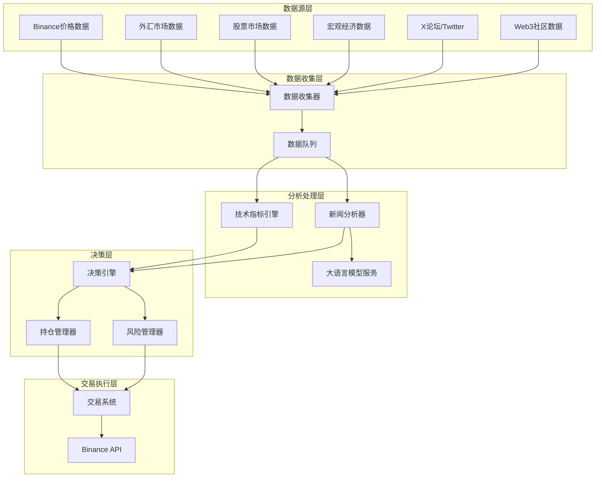

# 🚀 事件驱动比特币交易系统

一个基于AI驱动的自动化比特币交易系统，集成多源数据收集、情绪分析、技术指标分析和风险管理功能。

## ✨ 核心特性

### 🤖 AI驱动分析
- **智能情绪分析**: 使用OpenAI GPT-4分析新闻和社交媒体情绪
- **多源数据融合**: 整合Web3新闻、Twitter、宏观经济数据
- **实时决策引擎**: 综合情绪和技术指标生成交易决策

### 📊 技术分析
- **技术指标计算**: RSI、MACD、布林带、移动平均线
- **实时市场数据**: 通过Binance API获取价格和交易量数据
- **历史数据回测**: 验证交易策略的历史表现

### 🛡️ 风险管理
- **智能风险控制**: 动态调整仓位大小和止损点
- **多层安全保护**: API密钥加密、输入验证、SQL注入防护
- **实时监控告警**: 异常情况自动通知和处理

### 🏗️ 现代化架构
- **事件驱动设计**: 微服务架构，组件解耦
- **异步处理**: Celery分布式任务队列
- **多数据库支持**: PostgreSQL + InfluxDB + Redis
- **容器化部署**: Docker Compose一键部署

## 🏛️ 系统架构



## 🛠️ 技术栈

### 后端核心
- **Python 3.11+**: 主要开发语言
- **FastAPI**: 高性能异步Web框架
- **SQLAlchemy**: ORM数据库操作
- **Celery**: 分布式任务处理
- **Pydantic**: 数据验证和序列化

### 数据存储
- **PostgreSQL 15+**: 主数据库（交易记录、配置）
- **InfluxDB 2.7+**: 时序数据库（价格、指标）
- **Redis 7+**: 缓存和消息队列

### 外部服务
- **OpenAI GPT-4**: AI情绪分析
- **Binance API**: 交易执行和市场数据
- **Twitter API v2**: 社交媒体数据
- **各类新闻API**: 多源新闻数据

### 前端展示
- **HTML5 + JavaScript**: Web演示界面
- **实时数据展示**: WebSocket连接
- **响应式设计**: 移动端适配

## 🚀 快速开始

### 环境要求

- Python 3.11+
- Docker & Docker Compose
- Git

### 1. 克隆项目

```bash
git clone <repository-url>
cd bitcoin-trading-system
```

### 2. 后端设置

```bash
cd backend

# 创建虚拟环境
python -m venv venv
source venv/bin/activate  # Windows: venv\Scripts\activate

# 安装依赖
pip install -r requirements.txt

# 配置环境变量
cp .env.example .env
# 编辑 .env 文件，填入你的API密钥
```

### 3. 启动数据库服务

```bash
# 启动数据库容器
docker-compose up postgres influxdb redis -d
```

### 4. 数据库初始化

```bash
# 运行数据库迁移
alembic upgrade head
```

### 5. 启动应用

```bash
# 启动FastAPI服务器
uvicorn main:app --reload

# 新终端：启动Celery工作进程
celery -A celery_app worker --loglevel=info

# 新终端：启动Celery调度器
celery -A celery_app beat --loglevel=info
```

### 6. 访问应用

- **API文档**: http://localhost:8000/docs
- **Web演示**: 打开 `web-demo/index.html`
- **健康检查**: http://localhost:8000/health

## 🔧 配置说明

### 环境变量配置

在 `backend/.env` 文件中配置以下关键参数：

```bash
# 数据库配置
POSTGRES_HOST=localhost
POSTGRES_PORT=5432
POSTGRES_DB=trading_system
POSTGRES_USER=your_user
POSTGRES_PASSWORD=your_password

# API密钥
OPENAI_API_KEY=your_openai_key
BINANCE_API_KEY=your_binance_key
BINANCE_SECRET_KEY=your_binance_secret
TWITTER_BEARER_TOKEN=your_twitter_token

# 交易参数
MAX_POSITION_SIZE=0.1          # 最大仓位比例 (10%)
MAX_DAILY_LOSS=0.05           # 最大日亏损 (5%)
STOP_LOSS_PERCENTAGE=0.02     # 止损比例 (2%)
MIN_CONFIDENCE_THRESHOLD=0.7  # 最小交易置信度
```

### 交易策略配置

系统支持多种交易策略配置：

- **保守策略**: 低风险，小仓位，高置信度要求
- **积极策略**: 中等风险，适中仓位，平衡收益风险
- **激进策略**: 高风险，大仓位，追求最大收益

## 📊 功能模块

### 数据收集模块
- 实时新闻数据收集
- 社交媒体情绪监控
- 宏观经济指标跟踪
- 市场价格数据获取

### AI分析模块
- GPT-4驱动的新闻情绪分析
- 多维度影响评估
- 市场趋势预测
- 风险因子识别

### 技术分析模块
- 20+种技术指标计算
- 多时间框架分析
- 趋势识别和信号生成
- 支撑阻力位计算

### 风险管理模块
- 动态仓位管理
- 止损止盈设置
- 最大回撤控制
- 资金管理优化

### 交易执行模块
- Binance API集成
- 订单管理和跟踪
- 实时持仓监控
- 交易记录和分析

## 🧪 测试

### 运行测试

```bash
cd backend

# 运行所有测试
pytest

# 运行特定测试
pytest tests/test_data_models.py

# 生成测试覆盖率报告
pytest --cov=. --cov-report=html
```

### 测试策略

- **单元测试**: 验证各组件功能正确性
- **属性测试**: 使用Hypothesis进行属性验证
- **集成测试**: 测试组件间交互
- **回测验证**: 历史数据策略验证

## 📈 监控和运维

### 系统监控

- **健康检查**: `/health` 端点
- **性能指标**: CPU、内存、数据库连接
- **业务指标**: 交易成功率、盈亏统计
- **告警机制**: 异常情况自动通知

### 日志管理

- **结构化日志**: JSON格式便于分析
- **分级日志**: DEBUG/INFO/WARNING/ERROR
- **日志轮转**: 自动清理历史日志
- **集中收集**: 支持ELK Stack集成

## 🔒 安全特性

- **API密钥加密**: 敏感信息加密存储
- **访问控制**: 基于角色的权限管理
- **输入验证**: Pydantic数据验证
- **SQL注入防护**: SQLAlchemy ORM保护
- **速率限制**: API调用频率控制

## 📚 API文档

启动服务后访问以下地址查看完整API文档：

- **Swagger UI**: http://localhost:8000/docs
- **ReDoc**: http://localhost:8000/redoc

### 主要API端点

```bash
GET  /health              # 健康检查
GET  /api/status          # 系统状态
GET  /api/portfolio       # 投资组合信息
GET  /api/trades          # 交易历史
POST /api/trades          # 手动交易
GET  /api/analysis        # 市场分析结果
```

## 🤝 贡献指南

欢迎贡献代码！请遵循以下步骤：

1. Fork 项目
2. 创建特性分支 (`git checkout -b feature/AmazingFeature`)
3. 提交更改 (`git commit -m 'Add some AmazingFeature'`)
4. 推送到分支 (`git push origin feature/AmazingFeature`)
5. 开启 Pull Request

### 代码规范

```bash
# 代码格式化
black .

# 代码检查
flake8 .

# 类型检查
mypy .
```

## 📄 许可证

本项目采用 MIT 许可证 - 查看 [LICENSE](LICENSE) 文件了解详情。

## ⚠️ 免责声明

本系统仅供学习和研究使用。加密货币交易存在高风险，可能导致资金损失。使用本系统进行实际交易前，请：

1. 充分了解加密货币市场风险
2. 仅投资您能承受损失的资金
3. 在沙盒环境中充分测试
4. 考虑寻求专业投资建议

作者不对使用本系统造成的任何损失承担责任。

## 📞 支持与反馈

- **问题报告**: [GitHub Issues](../../issues)
- **功能建议**: [GitHub Discussions](../../discussions)
- **技术交流**: 欢迎提交PR和Issue

---

⭐ 如果这个项目对你有帮助，请给个Star支持一下！
